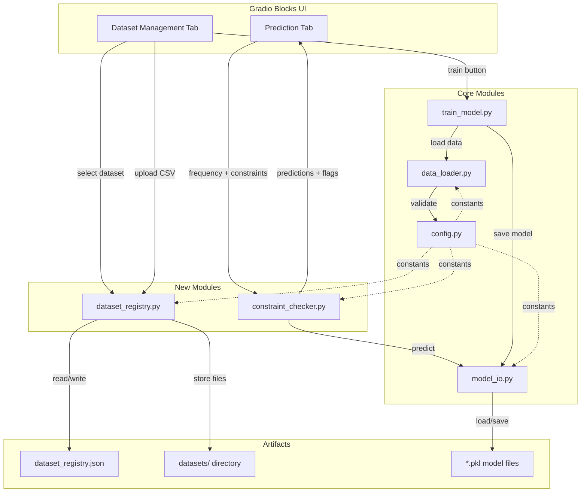
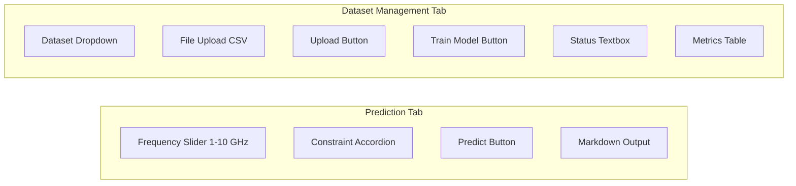

# Design Document: Expanded Prediction Pipeline

## Overview

This design expands the antenna-ml application across four axes:

1. **Wider frequency range** — The prediction slider and validation logic move from 2–7 GHz to 1–10 GHz.
2. **Dimension constraints** — Optional min/max bounds on each predicted antenna parameter, applied as post-prediction filters that flag out-of-bounds values.
3. **Dataset management** — A JSON-based dataset registry, in-app dataset selection dropdown, CSV upload with validation, and UI-triggered model retraining with hot-reload.
4. **Binary packaging** — PyInstaller bundles the Gradio app, model artifacts, default dataset, and all dependencies into a standalone executable.

The flat module structure is preserved. All new constants go into `config.py`. The Gradio UI migrates from a single `gr.Interface` to `gr.Blocks` with a tabbed layout (Prediction tab + Dataset Management tab).

## Architecture



### Key Architectural Decisions

| Decision | Rationale |
|----------|-----------|
| Post-prediction constraint checking (not model input) | The RF model is trained on frequency→parameters. Constraints are user-side filters, not training features. Adding them as model inputs would require multi-dimensional training data that doesn't exist. |
| JSON file for dataset registry | Simple, human-readable, no database dependency. Fits the flat-file project convention. |
| `gr.Blocks` instead of `gr.Interface` | Required for tabbed layout, dynamic component updates (dropdown refresh), and progress indicators during training. |
| New `dataset_registry.py` module | Isolates registry CRUD from data_loader.py (which handles DataFrame operations) and from gradio_app.py (which handles UI). |
| New `constraint_checker.py` module | Keeps constraint logic testable independently of the Gradio UI and the prediction engine. |
| PyInstaller single-directory mode | More reliable than single-file for bundling Gradio's static assets and model .pkl files. Single-file mode extracts to a temp dir on every launch, which is slow and fragile for large bundles. |

## Components and Interfaces

### 1. `config.py` — Extended Constants

New constants added to the existing module:

```python
# --- Expanded frequency range ---
FREQ_MIN = 1.0   # was 2.0
FREQ_MAX = 10.0  # was 7.0

# --- Dataset management ---
DATASETS_DIR = "datasets"                          # directory for uploaded CSVs
DATASET_REGISTRY_PATH = "dataset_registry.json"    # registry JSON file
MIN_DATASET_ROWS = 10                              # minimum rows for validation
DEFAULT_DATASET_NAME = "WiFi7 Default"             # name for the bundled dataset

# --- Dimension constraint parameter names and units ---
CONSTRAINT_PARAMS = {
    "length of patch in mm": "mm",
    "width of patch in mm": "mm",
    "length of substrate in mm": "mm",
    "width of Substrate in mm": "mm",
    "Area of Slots(mm^2)": "mm²",
    "Radiaus of Circular Slot(mm)": "mm",
    "S11(dB)": "dB",
}

# --- PyInstaller ---
PYINSTALLER_ENTRY = "gradio_app.py"                # entry point for the executable
PYINSTALLER_NAME = "antenna-ml"                     # output executable name
PYINSTALLER_BUNDLE_DATA = [                         # extra data files to bundle
    ("dataset_WIFI7.csv", "."),
    ("dataset_registry.json", "."),
    ("datasets", "datasets"),
]
```

### 2. `dataset_registry.py` — Registry CRUD

New module. Manages the `dataset_registry.json` file.

```python
# dataset_registry.json schema:
{
    "datasets": {
        "WiFi7 Default": {
            "path": "dataset_WIFI7.csv",
            "columns": ["Frequency(GHz)", "length of patch in mm", ...],
            "row_count": 3000,
            "freq_min": 2.0,
            "freq_max": 7.0,
            "added_at": "2024-01-15T10:30:00"
        }
    }
}
```

Public interface:

| Function | Signature | Description |
|----------|-----------|-------------|
| `load_registry` | `() → dict` | Read and return the registry dict. Creates empty registry if file missing. |
| `save_registry` | `(registry: dict) → None` | Write registry dict to JSON file. |
| `list_datasets` | `() → list[str]` | Return sorted list of registered dataset names. |
| `get_dataset_path` | `(name: str) → str` | Return file path for a named dataset. Raises `KeyError` if not found. |
| `register_dataset` | `(name: str, path: str, df: pd.DataFrame) → None` | Add entry to registry with metadata extracted from the DataFrame. Raises `ValueError` if name already exists. |
| `init_default_dataset` | `() → None` | Ensure the default dataset is registered on first run. |

### 3. `constraint_checker.py` — Post-Prediction Constraint Checking

New module. Applies user-supplied dimension bounds to prediction results.

```python
@dataclass
class ConstraintResult:
    parameter: str
    predicted_value: float
    min_bound: float | None
    max_bound: float | None
    in_bounds: bool

def validate_constraints(
    constraints: dict[str, tuple[float | None, float | None]]
) -> list[str]:
    """Check that min <= max for each constraint. Return list of error messages."""

def apply_constraints(
    predictions: dict[str, float],
    constraints: dict[str, tuple[float | None, float | None]]
) -> list[ConstraintResult]:
    """Check each prediction against its bounds. Return list of ConstraintResult."""
```

### 4. `data_loader.py` — Extended Validation

The existing `validate_dataset()` is extended with a `min_rows` parameter (default `config.MIN_DATASET_ROWS`). The frequency range check uses the new `FREQ_MIN`/`FREQ_MAX` values. A new function is added:

```python
def validate_uploaded_dataset(df: pd.DataFrame) -> ValidationResult:
    """Stricter validation for user-uploaded CSVs.
    
    Checks: frequency column exists, all numeric, no NaN, min 10 rows.
    Returns ValidationResult with all detected errors.
    """
```

### 5. `gradio_app.py` — Tabbed Blocks Layout

Migrates from `gr.Interface` to `gr.Blocks` with two tabs:

**Prediction Tab:**
- Frequency slider (1.0–10.0 GHz)
- Collapsible accordion for dimension constraints (one row per parameter: label, min input, max input)
- Predict button
- Markdown output with predictions table; flagged parameters show ⚠️ icon

**Dataset Management Tab:**
- Dataset dropdown (populated from registry)
- File upload component (CSV only)
- Upload button → validates → registers → refreshes dropdown
- "Train Model" button → runs training pipeline on selected dataset
- Status textbox for progress/errors
- Metrics display (R², MSE, MAE per parameter) after training



### 6. `train_model.py` — Callable Training Function

The existing `main()` is refactored to extract a reusable function:

```python
def train_on_dataset(dataset_path: str, model_prefix: str) -> dict:
    """Run the full training pipeline on a given dataset.
    
    Args:
        dataset_path: Path to the CSV file.
        model_prefix: Prefix for saving model artifacts.
    
    Returns:
        Dict with keys: train_r2, test_r2, train_mse, test_mse,
        per_param (list of dicts with r2, mse, mae per column).
    
    Raises:
        SystemExit on validation failure, OSError on I/O errors.
    """
```

`main()` becomes a thin wrapper calling `train_on_dataset(config.DATASET_PATH, "base")`.

### 7. `model_io.py` — Dynamic Prefix Support

`config.MODEL_FILES` currently only has "base" and "tuned" keys. For dataset-specific models, `save_model` and `load_model` are extended to accept arbitrary prefixes by generating file paths from a naming convention:

```python
def _artifact_paths(prefix: str) -> dict[str, str]:
    """Return artifact file paths for a given prefix.
    
    If prefix is in MODEL_FILES, use those paths.
    Otherwise, generate paths: rf_antenna_model_{prefix}.pkl, etc.
    """
```

`find_best_model()` is updated to also search for dataset-specific prefixes.

### 8. Binary Packaging — PyInstaller Spec

A `build_exe.py` script (or `antenna-ml.spec` file) configures PyInstaller:

- Entry point: `gradio_app.py`
- Hidden imports: `sklearn`, `gradio`, `pandas`, `numpy`, `joblib`
- Data files: default dataset CSV, `dataset_registry.json`, `datasets/` dir, `*.pkl` model files, Gradio static assets
- Output: `dist/antenna-ml/` directory (single-directory mode)
- `run.sh` gets a new `build-exe` command

## Data Models

### Dataset Registry JSON Schema

```json
{
    "datasets": {
        "<dataset_name>": {
            "path": "<relative_path_to_csv>",
            "columns": ["<col1>", "<col2>", "..."],
            "row_count": 0,
            "freq_min": 0.0,
            "freq_max": 0.0,
            "added_at": "<ISO8601_timestamp>"
        }
    }
}
```

### ConstraintResult Dataclass

```python
@dataclass
class ConstraintResult:
    parameter: str           # e.g. "length of patch in mm"
    predicted_value: float   # model output
    min_bound: float | None  # user-supplied minimum (None = unconstrained)
    max_bound: float | None  # user-supplied maximum (None = unconstrained)
    in_bounds: bool          # True if value satisfies all supplied bounds
```

### TrainingMetrics Dataclass

```python
@dataclass
class TrainingMetrics:
    train_r2: float
    test_r2: float
    train_mse: float
    test_mse: float
    per_param: list[dict]  # each: {"name": str, "r2": float, "mse": float, "mae": float}
```

### ValidationResult (Extended)

The existing `ValidationResult` dataclass is unchanged. The new `validate_uploaded_dataset()` function returns the same type, ensuring consistency.

### Dimension Constraints Input Format

Constraints are passed as a dict from the UI layer to `constraint_checker.py`:

```python
# Key: parameter name, Value: (min_bound_or_None, max_bound_or_None)
constraints: dict[str, tuple[float | None, float | None]]

# Example:
{
    "length of patch in mm": (5.0, 20.0),    # both bounds
    "S11(dB)": (None, -10.0),                # max only
}
```

## Correctness Properties

*A property is a characteristic or behavior that should hold true across all valid executions of a system — essentially, a formal statement about what the system should do. Properties serve as the bridge between human-readable specifications and machine-verifiable correctness guarantees.*

### Property 1: In-range frequency produces complete predictions

*For any* frequency value `f` where `1.0 <= f <= 10.0`, calling the prediction function with `f` shall return a prediction value for every target antenna parameter (all columns except Frequency), with no missing or null values.

**Validates: Requirements 1.1, 1.2**

### Property 2: Out-of-range frequency produces warning

*For any* frequency value `f` where `f < 1.0` or `f > 10.0`, calling the prediction function with `f` shall return a warning string (not predictions), and the warning shall contain the supported range boundaries.

**Validates: Requirements 1.3**

### Property 3: Empty constraints preserve unconstrained prediction

*For any* frequency value in the valid range, applying constraints with an empty constraints dict shall produce `ConstraintResult` entries that are all marked `in_bounds=True`, and the predicted values shall be identical to those returned without any constraint checking.

**Validates: Requirements 2.2**

### Property 4: Constraint bound checking correctness

*For any* set of predictions (dict of parameter name → float) and *for any* set of constraints (dict of parameter name → (min, max) bounds), `apply_constraints` shall mark a parameter `in_bounds=True` if and only if the predicted value satisfies all supplied bounds (value >= min when min is provided, value <= max when max is provided). A parameter with no constraint entry shall be marked `in_bounds=True`.

**Validates: Requirements 2.3, 2.4**

### Property 5: Invalid constraint bounds are rejected

*For any* constraint where the supplied minimum value is strictly greater than the supplied maximum value, `validate_constraints` shall return a non-empty error list containing a message that references the offending parameter name.

**Validates: Requirements 2.6**

### Property 6: Dataset registry serialization round-trip

*For any* valid registry dict (containing dataset entries with name, path, columns, row_count, freq_min, freq_max, added_at), calling `save_registry` followed by `load_registry` shall produce a dict equal to the original.

**Validates: Requirements 3.2**

### Property 7: Dataset registration and retrieval

*For any* valid dataset (DataFrame passing validation) with a unique name, after calling `register_dataset`, the name shall appear in `list_datasets()` and `get_dataset_path` shall return the registered path.

**Validates: Requirements 4.3**

### Property 8: Dataset validation catches all violations

*For any* DataFrame, `validate_uploaded_dataset` shall return a `ValidationResult` where the errors list contains an entry for each of the following violations that is present: (a) missing "Frequency(GHz)" column, (b) any non-numeric column, (c) any NaN value, (d) fewer than 10 rows. If none of these violations are present, the result shall have `valid=True` and an empty errors list.

**Validates: Requirements 4.2, 4.4, 5.1, 5.2, 5.3, 5.4, 5.5**

### Property 9: Training produces complete metrics

*For any* valid dataset (passing validation with sufficient rows), calling `train_on_dataset` shall return a metrics dict containing `train_r2`, `test_r2`, `train_mse`, `test_mse` (all floats), and a `per_param` list with one entry per target column, where each entry contains `name`, `r2`, `mse`, and `mae` keys.

**Validates: Requirements 3.4, 7.2, 7.4**

### Property 10: Dataset-specific model prefixes produce unique artifact paths

*For any* two distinct dataset names, the artifact file paths generated by `_artifact_paths` for each name shall be completely disjoint (no shared file paths), ensuring models trained on different datasets never overwrite each other.

**Validates: Requirements 7.6**

## Error Handling

| Scenario | Module | Behavior |
|----------|--------|----------|
| Frequency out of range (< 1.0 or > 10.0) | `gradio_app.py` | Return warning string with range info; do not call model |
| Constraint min > max | `constraint_checker.py` | `validate_constraints` returns error list; UI blocks prediction |
| Model artifacts missing on startup | `gradio_app.py` | Show message prompting user to select dataset and train |
| Dataset CSV not found at registered path | `dataset_registry.py` | `get_dataset_path` raises `FileNotFoundError`; UI shows error |
| Uploaded CSV fails schema validation | `data_loader.py` | Return `ValidationResult` with all errors; UI displays them |
| Uploaded CSV has duplicate name | `dataset_registry.py` | `register_dataset` raises `ValueError`; UI shows "name exists" |
| Training fails (bad data, runtime error) | `train_model.py` | `train_on_dataset` raises exception; UI catches it, shows error, retains previous model |
| Registry JSON corrupted or missing | `dataset_registry.py` | `load_registry` returns empty registry dict; logs warning |
| Model load integrity check fails | `model_io.py` | `load_model` raises `ValueError` with descriptive message |
| PyInstaller bundle missing default dataset | `gradio_app.py` | Graceful startup with empty registry; user must upload a dataset |

All errors are logged via Python `logging` before being surfaced to the UI. The Gradio UI wraps all callback functions in try/except blocks to prevent unhandled exceptions from crashing the app.

## Testing Strategy

### Testing Framework

- **Unit & integration tests**: `pytest` (existing, v7.4.4)
- **Property-based tests**: `hypothesis` (to be added to `requirements.txt`)
- **Coverage**: `pytest-cov` with existing 80% minimum threshold

### Property-Based Testing Configuration

- Library: [Hypothesis](https://hypothesis.readthedocs.io/) for Python
- Each property test runs a minimum of 100 examples (`@settings(max_examples=100)`)
- Each property test is tagged with a comment referencing the design property:
  `# Feature: expanded-prediction-pipeline, Property {N}: {title}`
- Each correctness property is implemented by a single `@given(...)` test function

### Test File Organization

| Test File | Covers |
|-----------|--------|
| `tests/test_config.py` | Extended constants (FREQ_MIN, FREQ_MAX, DATASETS_DIR, etc.) |
| `tests/test_constraint_checker.py` | Properties 3, 4, 5 — constraint validation and application |
| `tests/test_dataset_registry.py` | Properties 6, 7 — registry CRUD, round-trip, registration |
| `tests/test_data_loader.py` | Property 8 — extended validation for uploaded datasets |
| `tests/test_train_model.py` | Property 9 — training metrics completeness |
| `tests/test_model_io.py` | Property 10 — prefix uniqueness |
| `tests/test_gradio_app.py` | Properties 1, 2 — prediction function frequency handling |
| `tests/test_integration.py` | End-to-end: upload → validate → register → train → predict |

### Unit Tests (Examples & Edge Cases)

Unit tests complement property tests by covering:

- Config constants have exact expected values (Req 1.5, 8.1–8.3)
- Slider component bounds match config (Req 1.4)
- Dropdown populated from registry on startup (Req 3.1, 3.3)
- Duplicate dataset name rejection (Req 4.5 — edge case)
- Training failure retains previous model (Req 7.5 — edge case)
- No-model-bundled startup prompt (Req 6.5)
- Logging output for validation errors (Req 5.6)

### Property Tests (Universal Properties)

Each property from the Correctness Properties section maps to one `@given` test:

| Property | Generator Strategy |
|----------|--------------------|
| P1: In-range predictions | `st.floats(min_value=1.0, max_value=10.0)` |
| P2: Out-of-range warning | `st.floats().filter(lambda f: f < 1.0 or f > 10.0)` |
| P3: Empty constraints identity | `st.floats(min_value=1.0, max_value=10.0)` |
| P4: Constraint correctness | `st.dictionaries(param_names, st.tuples(optional_float, optional_float))` combined with random predictions |
| P5: Invalid bounds rejected | `st.floats()` pairs where min > max |
| P6: Registry round-trip | `st.dictionaries` generating valid registry entries |
| P7: Register then retrieve | Random dataset names + valid DataFrames |
| P8: Validation catches all | DataFrames with randomly injected violations |
| P9: Training metrics | Valid DataFrames with sufficient rows |
| P10: Prefix uniqueness | `st.text()` pairs of distinct dataset names |
